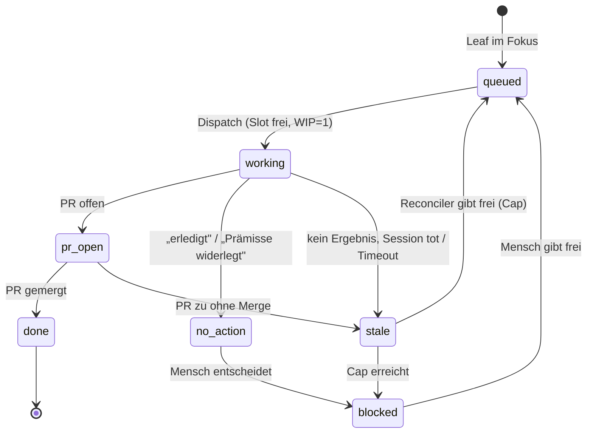

# Runner-Architektur — Reconciler statt Prompt

Stand: 2026-09-23. Zielbild + Migrationsplan für die `rift-*`-Runner.
Vorgänger: `docs/automations.md` (Ist, Betrieb), `docs/milestone-methodology.md` (Regeln).

## 1. Warum (die Fehlerklassen)

Am 2026-09-23 sind zwei WIP=1-Deadlocks aufgetreten (#393, #895). Beide haben dieselbe Wurzel:

1. **Entscheidungen stecken im Prompt.** „Slot belegt? Leaf? erledigt?" sind _Prosa_ in
   `config/automations/rift-triage.prompt.md`, die das Modell interpretiert. Jede Regeländerung
   = Prompt-Deploy; Verhalten ist nicht reproduzierbar und nicht offline testbar.
2. **Zustand wird aus Konventionen geparst.** „Hängt der Dispatch?" = _letzter Kommentar beginnt
   mit `[ALREADY-DONE]`_. „Fertig?" = _hat GitHub das Issue wegen `Closes` zugeklappt?_
   Beides ist implizit und hat Lücken:
   - PR mit „Refs #<n>" → Issue bleibt offen → Label klebt → Slot blockiert (#893/PR #897);
   - Worker fertig **ohne** Deliverable (Befund/Prämisse widerlegt) → passt in **keine** Regel
     (#895).
3. **Es gibt Zustände ohne Ausgang.** Ein Zustand, aus dem niemand (auch nicht der Reconciler)
   automatisch herausführt, _ist_ der Deadlock.

Zusätzlich ist die Slot-Prüfung **innerhalb** des Model-Turns gelaufen: jeder Tick kostete
~50k Tokens, auch wenn nichts zu tun war. Teilweise behoben durch die Shell-Ticks
(`rift-triage-tick.sh`, `rift-pr-gate-tick.sh`, siehe `docs/automations.md`).

## 2. Zielbild

**GitHub ist die Datenbank. Labels sind der Zustand. Ein Shell-Reconciler zieht die Übergänge.
Das Modell ist nur noch für Aufgaben mit echtem Urteil da (Bauen, Review).**

### Label-Schema

`qt:queued` · `qt:working` · `qt:pr-open` · `qt:no-action` · `qt:stale` · `qt:blocked` · `qt:done`

(`qt:` = „queue/triage". Ersetzt die Marker-Konventionen `[ALREADY-DONE]` und das
`orchestrator:dispatched` als alleinige Wahrheit.)

### Übergänge (vollständig)

| Von         | Nach        | Auslöser                                                                  | Wer        |
| ----------- | ----------- | ------------------------------------------------------------------------- | ---------- |
| `queued`    | `working`   | Slot frei + Leaf + Reihenfolge                                            | Reconciler |
| `working`   | `pr_open`   | Worker pusht PR, setzt Label                                              | Worker     |
| `working`   | `no_action` | Worker belegt: erledigt / Prämisse widerlegt                              | Worker     |
| `working`   | `stale`     | kein Outcome-Label **und** Session `done/failed` **und** Grace abgelaufen | Reconciler |
| `stale`     | `queued`    | Freigabe-Zähler < Cap (3)                                                 | Reconciler |
| `stale`     | `blocked`   | Cap erreicht (Mensch muss schauen)                                        | Reconciler |
| `pr_open`   | `done`      | PR gemergt (via `Closes` oder Referenz-Cleanup)                           | Reconciler |
| `pr_open`   | `stale`     | PR geschlossen ohne Merge                                                 | Reconciler |
| `no_action` | `blocked`   | Mensch entscheidet (neu zuschneiden / schließen)                          | Mensch     |
| `blocked`   | `queued`    | Mensch entfernt `qt:blocked`                                              | Mensch     |
| `done`      | —           | terminal                                                                  | —          |

**Garantie:** Jeder nicht-terminale Zustand hat einen Ausgang, den der Reconciler **ohne
Mensch** gehen kann — außer `blocked`. `blocked` **belegt den Slot nicht**, deshalb kann ein
offener Mensch-Entscheid die Pipeline nie anhalten. (Das ist genau die Lücke, die #895
gerissen hat.)

## 3. Arbeitsteilung

| Aufgabe                                                                        | Wer                    | Kosten   |
| ------------------------------------------------------------------------------ | ---------------------- | -------- |
| Fokus ermitteln, Zustände lesen, Label-Übergänge, Stale-Erkennung, Issue-Close | **Reconciler (Shell)** | 0 Tokens |
| Merge bei APPROVE + CLEAN + grüne Checks; Rebase bei BEHIND                    | **Reconciler (Shell)** | 0 Tokens |
| Task-Text rendern + Worker spawnen                                             | Reconciler (Template)  | ~0       |
| **Code bauen** (Orchestrator-Pipeline)                                         | Modell                 | Tokens   |
| **Review** (Diff/Tests/Security)                                               | Modell                 | Tokens   |
| Milestone-Kuration, Spikes/Design, DIRTY-Konflikte, „not planned"              | **Mensch**             | —        |

Konsequenz: die **Triage selbst wird modellfrei** — ihr Job ist Buchhalten + einen
Template-Text rendern.

## 4. Migrationsplan

- **Schritt 1 — erledigt (2026-09-23).** Guard + Schritt-4-Cleanup in die Shell-Ebene gezogen:
  `scripts/rift-triage-cleanup.sh` (+ Aufruf im `rift-triage-tick.sh`). Der Tick läuft die
  Buchhaltung jetzt **auch bei belegtem Slot** — behebt die Deadlock-Klasse „Aufräumen kam nie
  dran".
- **Schritt 2 — erledigt (2026-09-23).**
  - **2a:** Outcome-Label `triage:no-action` (Worker signalisiert „nichts zu bauen" — erledigt,
    Prämisse widerlegt oder Research-Bericht abgeliefert). Das Cleanup liest **Labels** vor
    Kommentar-Präfixen (`[ALREADY-DONE]` bleibt als Altpfad), das Leaf-Gate überspringt es.
  - **2b:** Guard — Bot-Kommentare zählen **nicht** mehr als Fortschritt; `done` **ohne** Outcome
    wird **geparkt** (Label weg + `question`, Slot frei) statt bis in alle Ewigkeit geskippt; am
    Hard Cap wird ebenfalls geparkt statt nur zu eskalieren. Beide Orchestrator-Personas
    (`coding-`, `planning-orchestrator`) tragen die Outcome-Pflicht.
  - Harnesse: `tests/rift-stale-dispatch/run.sh` **44/44**, `tests/rift-triage-cleanup/run.sh`
    **12/12**, `tests/rift-triage-tick/run.sh` **19/19**, `tests/rift-pr-gate-tick/run.sh` **20/20**.
  - Learnings: Eine „gemergter PR erwähnt das Issue"-Regel im Cleanup war **falsch** — eine
    Cross-Reference entsteht schon durch bloße Erwähnung (PR #660 → #623 irrtümlich closed).
    Solche Heuristiken gehören nicht in einen Prozess, der Issues schließt.
- **Schritt 3 — erledigt (23.09.), in der Shell-Variante.** Der `rift-triage-tick` wählt das
  Issue **deterministisch** (Checkliste aus der Milestone-Beschreibung, Fallback Epic-Reihenfolge,
  sonst aufsteigende Nummer, Leaf-Filter) und schreibt
  die Auswahl verbindlich nach `<state>/workspace/rift-triage-decision.md`; der Agent-Turn liest
  sie (Schritt 0 des Prompts) und **wählt nicht mehr** — er führt nur aus. Grund für den
  Datei-Kanal statt Trigger-Parameter: `openclaw automations run <id>` nimmt **keine** Argumente,
  und es gibt **kein** CLI-Äquivalent zu `sessions_spawn` (über RPC/HTTP per Default verboten).
  „Triage ganz ohne Modell" ist damit nicht erreichbar.
  **Native Alternative (dokumentiert, nicht gebaut):** `--trigger-script` — JS-Condition-Skript,
  Rückgabe `{fire, message?, state?}`, `fire:false` kostet 0 Tokens und erzeugt keinen
  Run-History-Eintrag; `message` wird **nur** bei `agentTurn`/`systemEvent`-Payloads angehängt
  (`<original>\n\n<trigger-message>`). Gotchas: `--agent` ist Pflicht, jeder `exec` zählt auf ein
  Budget von 5 Tool-Calls / 30 s, `exec` liefert bei > ~1 s `status:"running"` **ohne** Ausgabe
  (auto-`yieldMs`, explizit setzen), und `openclaw automations run` schickt `mode: force` und
  **strippt den Trigger**.
- **Schritt 4 — erledigt (23.09.).** Der `rift-pr-gate-tick` mergt deterministisch:
  `[VERDICT: APPROVE]` + `CLEAN` + ausschliesslich grüne Checks ⇒ `gh pr merge --squash
--delete-branch` (0 Tokens, live verifiziert mit PR #901 → #896 automatisch geschlossen). Nur
  Review/Rebase geht noch an den Agent-Turn.

Schritte 2–4 ändern Kontrollfluss, nicht die Methodik — `docs/milestone-methodology.md`
bleibt inhaltlich gültig (Fokus-Regel, Leaf-Gate, Milestone-Reihenfolge, WIP=1, Stacktiefe ≤ 3).

## 5. Teststrategie

Der Reconciler ist reine Funktion von (Milestone, Issues, PRs, Checks) → (Aktionen). Er lässt
sich **offline** testen, wie `tests/rift-focus-milestone/` und `tests/rift-stale-dispatch/`
(gh-Shim, kein Netz). Das ist der Punkt: der teuerste und fehleranfälligste Teil des Systems
wird der best-getestete.

## 6. Offene Fragen

1. **Worker-Outcome melden:** **entschieden** (2026-09-23) — **explizit** via Label
   `triage:no-action`, in beiden Orchestrator-Personas verankert. Der Reconciler leitet nichts ab.
2. **`qt:blocked` sichtbar machen:** eigene Status-Zeile im Triage-Log + optional ein
   Sammel-Kommentar, damit „wartet auf Mensch" nicht untergeht.
3. **Stack-Handoff:** Stacking (Basis ≠ `main`) ist in der Methodik erlaubt — die
   Zustandsmaschine muss Basis-Branch-Ketten kennen (Reihenfolge, Rebase-Kaskade). Eigener
   Abschnitt, sobald der erste echte Stack läuft.
